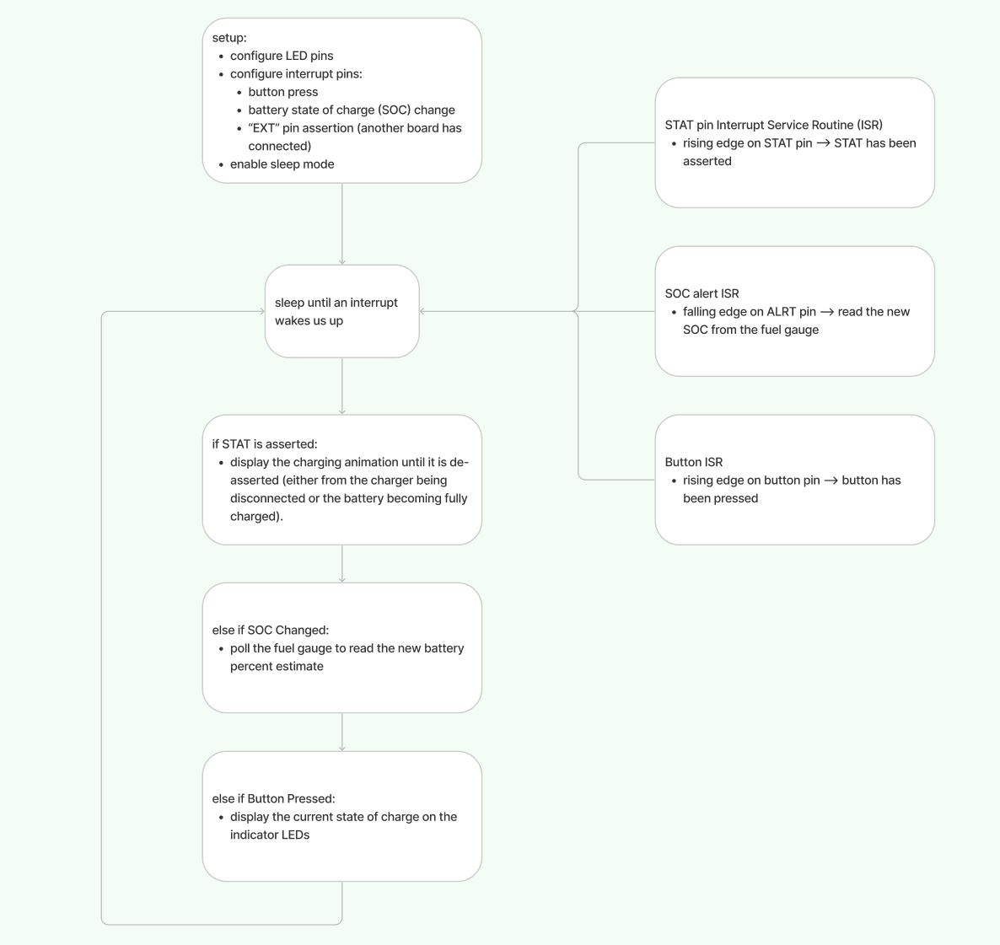

# Battery PCB Firmware Overview

The Battery PCB firmware can be found [here](https://github.com/0102io/testing/tree/main/tt_battery_fw_pio).

The battery pack's controller has a couple of straightforward jobs:
1. Determine the lipo cell's state of charge (SOC) from the fuel gauge IC. This is done once on a reset / power on, and then again for each 1% SOC change. 
2. Tell the controller what the the current SOC when it connects, and again for each 1% SOC change as long as it is connected.
3. Display the SOC on the indicator LEDs when the button is pressed.
4. Display the charging status when the battery charger is connected.

The firmware is summarized by this flow chart:

# Compiling the Firmware

This project uses PlatformIO for compilation and jtag2updi for program upload. We use Visual Studio Code with the PlatformIO extension, and setup was straightforward - follow their instructions. For jtag2updi, you'll need a programmer (we use an arduino uno set up as detailed [here](https://github.com/ElTangas/jtag2updi)). 

Once you've set all of that up, initiate the upload and hold the GND and UPDI wires to the contacts on the battery pack until the upload is complete. 

[reference pic needed]

# To-Dos
