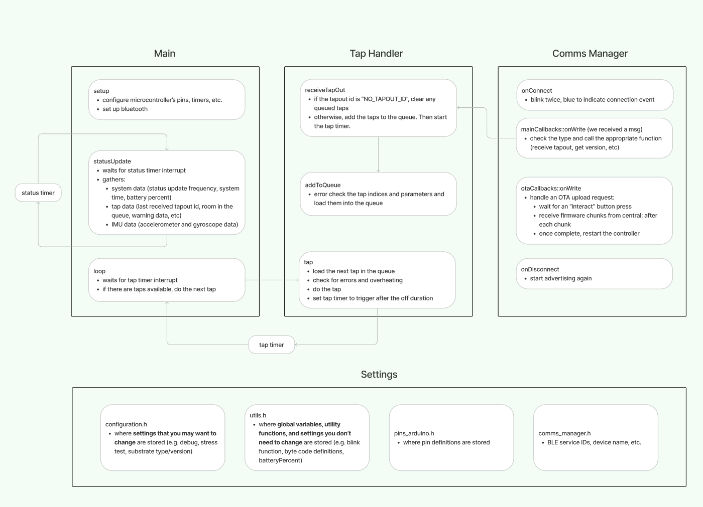

# Controller Firmware Overview

The controller firmware can be found [here](https://github.com/0102io/testing/tree/auto-light-sleep/tt_driver_fw_pio).

The controller's primary job is to receive a set of taps via the [bluetooth protocol](./protocol.md) and execute the taps with precise timing. The code is summarized by this flow chart:



# Compiling the Firmware

This project uses esp32-arduino, with re-compiled libraries made with the [esp32-arduino-lib-builder project](https://github.com/espressif/esp32-arduino-lib-builder), and it is structured for compilation with PlatformIO (and we use the VS Code extension). You can follow their guides for getting set up.

Next you'll need to move the custom board json files into your platformio folder. From the repository's root directory, copy the files from `./boards` into your platformio boards directory (for example, on a Mac this would likely be in `/Users/[your username]/.platformio/platforms/espressif32/boards`). 

Once you have those set up, you should be able to hit upload and let PlatformIO handle the rest.

# Building New esp32-arduino Libraries

We built new libraries for 2 reasons:
- we wanted to change some config options that we couldn't change in arduino (namely bluetooth/wifi modem sleep and auto light sleep)
- we weren't familiar with the ESP-IDF and didn't want to convert files and libraries

Here are the steps we used:

1. Edit `esp32-arduino-lib-builder/configs/defconfig.esp32s3` (settings for this project are located in the `documentation` folder of the controller firmware repository).

2. In a terminal window, navigate to the `esp32-arduino-lib-builder` folder and enter:
    ```bash
    rm -rf build # remove the existing build files if you've already compiled them
    rm -rf components/esp-rainmaker # we had to do this to get our build on Oct 2 to work, may not be necessary now
    ./build.sh -t esp32s3 -I idf-release/v5.1
    ./tool/copy-to-arduino # after this, copy the files listed in the script to the relevant location for platformIO - probably /Users/[your_username]/.platformio/packages/framework-arduinoespressif32
    ```
Note regarding the rainmaker module: we last built core files on Oct. 2, 2023, and encountered an error similar to [this GitHub issue](https://github.com/espressif/esp32-arduino-lib-builder/issues/138). For us, pulling the latest update (even fully re-installing the repository) didn't resolve the issue, so we added a specific line to the `update-components.sh` file (below) and removed the existing rainmaker component with the command above.
```bash
#
# CLONE/UPDATE ESP-RAINMAKER
#
echo "Updating ESP-RainMaker..."
if [ ! -d "$AR_COMPS/esp-rainmaker" ]; then
    git clone $RMAKER_REPO_URL "$AR_COMPS/esp-rainmaker" && \
    git -C "$AR_COMPS/esp-rainmaker" checkout 0414a8530ec1ac8714269302503c71c238b68836 # <------ this line
    git -C "$AR_COMPS/esp-rainmaker" submodule update --init --recursive
else
    git -C "$AR_COMPS/esp-rainmaker" fetch && \
    git -C "$AR_COMPS/esp-rainmaker" pull --ff-only && \
    git -C "$AR_COMPS/esp-rainmaker" submodule update --init --recursive
fi
if [ $? -ne 0 ]; then exit 1; fi
```

# To-Dos
1. Reduce power consumption. So far we've managed to reduce power by using the modem-sleep config setting, auto light sleep, and disabling the 12v regulator while we're idle. This results in an idle average current draw of around ~50mA, though it is well below that in between BLE connection events and well above that during those events, which happen at least every 30ms. While tapping, with the regulator enabled, the controller itself seems to draw 150-200mA. We're hoping some wizard our there can change some other settings to bring at least the idle current draw much lower. One thing we've seen is that NimBLE might be more power efficient for bluetooth.
2. Change TapQueue to store data in the same format as a TAP_OUT message - we don't need arrays for each setting. TapHandler::tap() has to be updated accordingly.
3. Add repeatCT and repeatDelay settings (ideally make the above change first though)
4. Figure out what we should do with the IMU data! 
5. Add HBDriver status register error notifications to the status message (see TapHandler::checkDiagnosticReg)